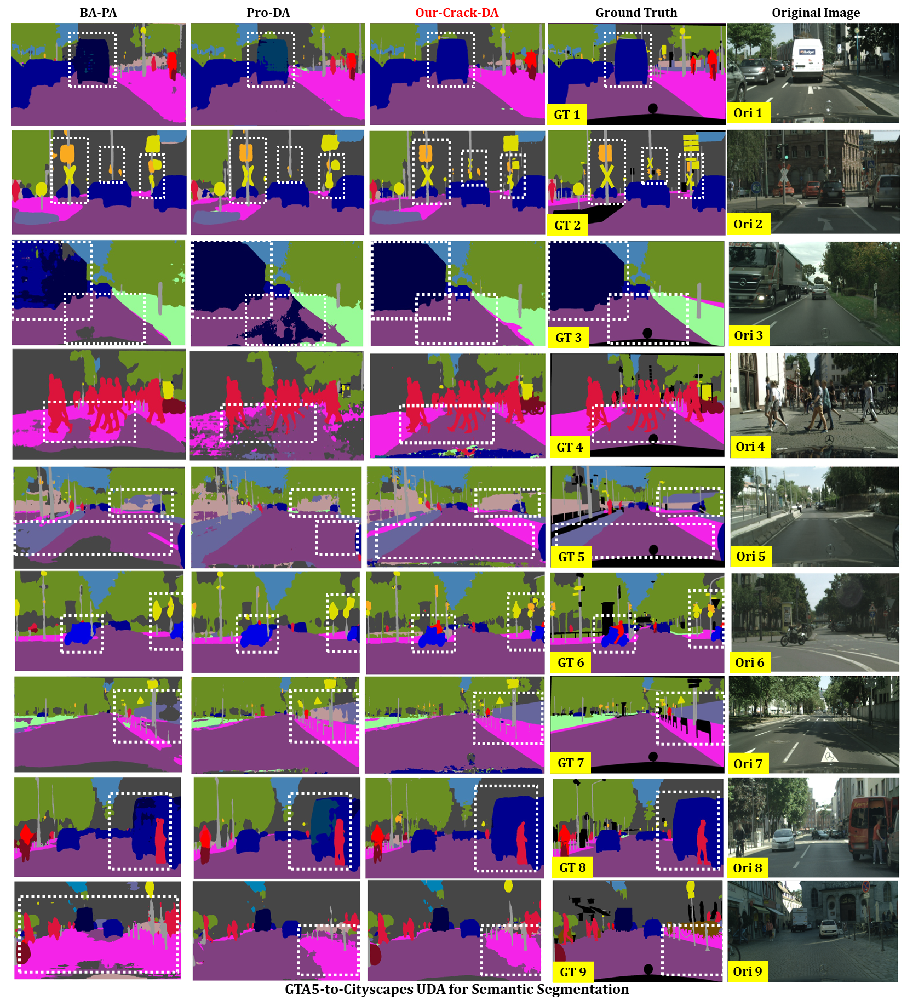
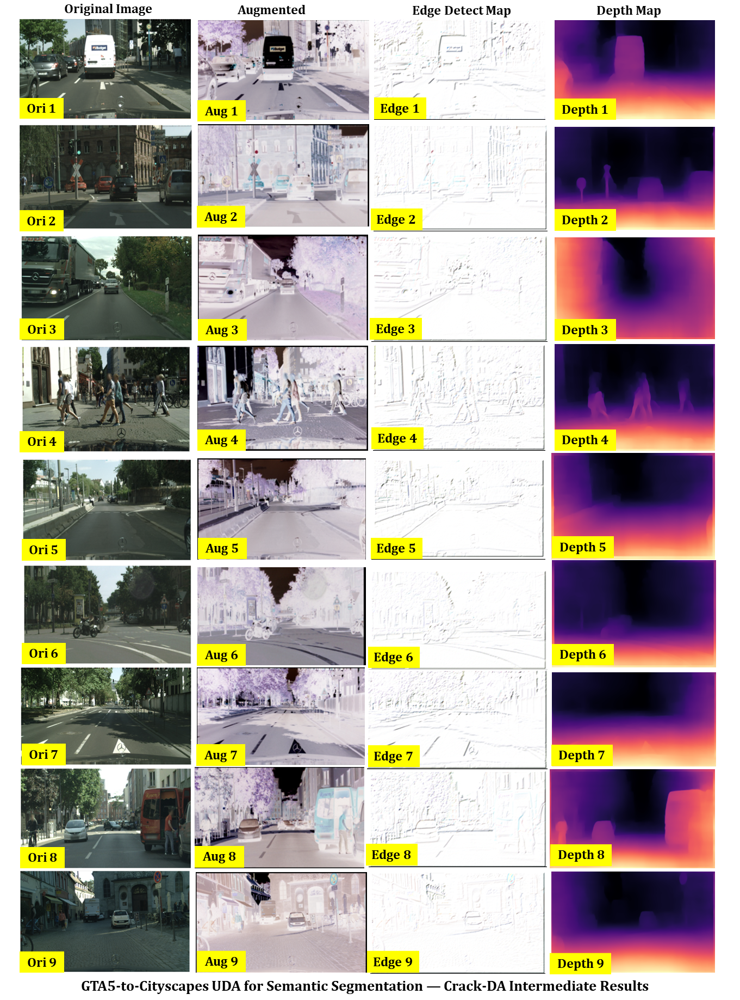

# Domain-Adaptation-Comparisons
 Comparisons of Various of Domain Adaptative Semantic Segmentation Algorithms in the large-scale domain adaptive semantic segmentation benchmark of **GTA5-to-Cityscapes**. It can be demonstrated that our proposed **Crack-DA** can have better performance than the SOTAs **BA-PA** and **Pro-DA** for both the **large semantic classes** such as the bus and train and the **small semantic classes** such as the pedestrians. The results further demonstrate the effectiveness of depth and edge features in the tasks of domain adaptive semantic segmentation.
 
 
 
# Our Crack-DA Cooresponding Edge and Depth Map
You can also find the corresponding data augmentation results, edge detection map, and depth prediction map by our **Crack-DA**. Our **Crack-DA** is the **first approach that makes full use of the auxiliary relative low-level depth and edge features to do UDA**. Our approach makes sense for the fact that **the edge and depth features are closely related to semantic features** as indicated by our experimental results below.

 
